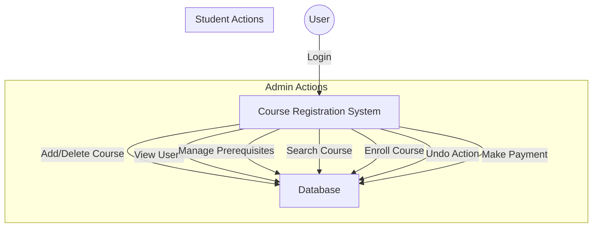

# Course Registration System - Project Report

**Submitted To:** Miss Rabia Amjad
**Course:** Data Structures and Algorithms

---

## 1. Acknowledgement

We would like to express our deepest gratitude to our instructor, **Miss Rabia Amjad**, for her guidance, encouragement, and valuable feedback throughout the development of this project. Her insights into Data Structures and Algorithms were instrumental in the successful implementation of this system. We also thank our university for providing the necessary resources and environment to complete this project.

## 2. Abstract

This project presents a comprehensive **Course Registration System** developed using C++. The primary objective is to automate the manual process of course enrollment, management, and student record-keeping. The system leverages advanced **Data Structures and Algorithms (DSA)**—including Binary Search Trees (BST), Linked Lists, Stacks, Queues, Hash Tables, and Graphs—to ensure efficient data storage, retrieval, and manipulation. Key features include role-based access control (Admin/Student), conflict detection via prerequisite checking, and secure authentication using string matching algorithms. This report details the design, implementation, and testing of the system, highlighting the practical application of theoretical DSA concepts.

## 3. Table of Contents

1.  Acknowledgement
2.  Abstract
3.  Table of Contents
4.  Introduction
5.  Background/Literature Review
6.  Problem Statement
7.  Objectives and Goals
8.  Project Scope
9.  Workflow (UML Representation)
10. Overview of Project
11. Tools and Technologies
12. Project Features
13. Implemented Concepts (with Code Details)
14. Output
15. Conclusion
16. References

## 4. Introduction

In the modern educational landscape, efficient management of student enrollments and course data is crucial. The Course Registration System is a console-based application designed to streamline these processes. It serves as a bridge between the administration and students, allowing administrators to manage the curriculum and students to select their academic path. By utilizing efficient algorithms, the system minimizes the time complexity of operations such as searching for a course or verifying prerequisites.

## 5. Background/Literature Review

Traditionally, course registration was a paper-based process involving manual form submissions, physical queues, and manual record updates. This method was not only time-consuming but also prone to human errors, such as lost forms, incorrect data entry, and enrollment in courses without meeting prerequisites.

Existing automated systems often rely on heavy database management systems (DBMS). However, for the purpose of understanding the core mechanics of data management, this project implements custom data structures from scratch in C++, demonstrating how low-level data organization impacts system performance.

## 6. Problem Statement

Manual course registration systems suffer from several inefficiencies:
*   **Data Redundancy:** Duplicate records for students or courses.
*   **Slow Retrieval:** Searching for a specific student or course in physical files is O(N) and very slow.
*   **Lack of Validation:** Students may enroll in courses for which they are not eligible (missing prerequisites).
*   **Concurrency Issues:** Difficulty in managing seat limits when multiple students apply simultaneously.

This project aims to solve these problems by implementing a digital solution that enforces rules and optimizes data access.

## 7. Objectives and Goals

*   **Efficiency:** To implement data structures (BST, Hash Tables) that reduce search and insertion time complexities.
*   **Data Integrity:** To ensure that course enrollments do not exceed capacity and prerequisites are met.
*   **Security:** To implement basic authentication mechanisms.
*   **Usability:** To provide a clear and distinct interface for Administrators and Students.
*   **Educational Value:** To demonstrate the practical application of Stacks, Queues, Linked Lists, Trees, and Graphs.

## 8. Project Scope

The system is designed for a university environment.
*   **Admin Module:** Allows adding/removing courses, viewing all users, managing prerequisites, and checking payment statuses.
*   **Student Module:** Allows viewing available courses, searching, enrolling, dropping courses (undo), and making payments.
*   **Data Persistence:** Currently, the system uses in-memory storage (RAM) initialized with seed data for demonstration purposes.

## 9. Workflow (UML Representation)

**Use Case Overview:**



**Activity Flow:**
1.  **Start** -> Login Screen.
2.  **Authentication** (Check Username/Password).
3.  **Decision:**
    *   If **Admin**: Show Admin Menu (Manage Courses, Users, etc.).
    *   If **Student**: Show Student Menu (Enroll, History, etc.).
4.  **Action Execution** (e.g., Enroll in Course).
5.  **Validation** (Check Seats, Prerequisites).
6.  **Update Data Structures**.
7.  **Logout** -> End.

## 10. Overview of Project

The project is a C++ console application. It follows an Object-Oriented Programming (OOP) paradigm. The core logic is encapsulated in the `CourseRegistrationSystem` class, which manages instances of custom data structure classes (`LinkedList`, `BST`, `HashTable`, etc.). The `main.cpp` file handles the user interface and menu navigation.

## 11. Tools and Technologies

*   **Programming Language:** C++ (Standard 11/14/17)
*   **IDE:** CLion / Visual Studio Code
*   **Build System:** CMake
*   **Compiler:** MinGW / GCC / MSVC
*   **Version Control:** Git

## 12. Project Features

### Functional Requirements
1.  **User Management:** Registration and Login for Students and Admins.
2.  **Course Catalog:** View list of courses sorted by Code or Name.
3.  **Search:** Find courses instantly by Course Code.
4.  **Enrollment:** Students can enroll in courses if seats are available.
5.  **Prerequisite Check:** System prevents enrollment if prerequisites are not met.
6.  **Undo:** Students can undo their last enrollment action.
7.  **Payments:** Process dummy payments and verify status via Transaction ID.

### Non-Functional Requirements
1.  **Performance:** Search operations are optimized to O(log n) or O(1).
2.  **Scalability:** Dynamic data structures (Linked Lists) allow the system to handle varying numbers of users.
3.  **Reliability:** Input validation prevents system crashes from invalid user input.

## 13. Implemented Concepts (with Code Details)

This project strictly implements the following Data Structures and Algorithms:

### A. Linked Lists
*   **Usage:** Storing the list of Users and Enrollment records.
*   **Code Snippet (`DataStructures.h`):**
    ```cpp
    template <typename T>
    class LinkedList {
        Node<T>* head;
        // ... insert, search, remove methods ...
    };
    ```
*   **Why:** Allows dynamic memory allocation for an unknown number of students.

### B. Binary Search Tree (BST)
*   **Usage:** Storing Course objects.
*   **Code Snippet (`DataStructures.h`):**
    ```cpp
    class BST {
        BSTNode* root;
        BSTNode* insertHelper(BSTNode* node, Course course);
        BSTNode* searchHelper(BSTNode* node, string code);
        // ...
    };
    ```
*   **Why:** Enables efficient searching (O(log n)) and sorted traversal of courses.

### C. Stack
*   **Usage:** Implementing the "Undo Last Action" feature.
*   **Code Snippet (`DataStructures.h`):**
    ```cpp
    template <typename T>
    class Stack {
        StackNode* top;
        void push(T data);
        bool pop(T& data);
    };
    ```
*   **Why:** LIFO (Last-In, First-Out) nature is perfect for reverting the most recent operation.

### D. Queue
*   **Usage:** Designed for managing course waitlists (implementation provided).
*   **Code Snippet (`DataStructures.h`):**
    ```cpp
    template <typename T>
    class Queue {
        QueueNode* front;
        QueueNode* rear;
        // ... enqueue, dequeue ...
    };
    ```

### E. Hash Table
*   **Usage:** Storing Payment records for fast lookup.
*   **Code Snippet (`DataStructures.h`):**
    ```cpp
    class HashTable {
        HashNode* table[TABLE_SIZE];
        int hashFunction(string key);
        // ... insert, search ...
    };
    ```
*   **Why:** Provides O(1) average time complexity for verifying transactions.

### F. Graph
*   **Usage:** Modeling Course Prerequisites.
*   **Code Snippet (`DataStructures.h`):**
    ```cpp
    class Graph {
        struct AdjListNode { string dest; ... };
        struct GraphNode { string courseCode; AdjListNode* head; ... };
        // ... addPrerequisite, getPrerequisites ...
    };
    ```
*   **Why:** Represents the dependency relationships between courses.

### G. Algorithms
1.  **KMP String Matching:** Used in `login()` for secure password verification.
2.  **Sorting (Quick/Merge Sort):** Used via `std::sort` to display courses alphabetically by name.
3.  **Binary Search:** Implicit in BST operations.

## 14. Output

*(Note: In a real report, paste screenshots here. Below are descriptions of expected outputs)*

**Screenshot 1: Main Menu**
> Displays options: 1. Login, 2. Register, 3. Exit.

**Screenshot 2: Admin Dashboard**
> Shows options to Add Course, Delete Course, View Users, etc.

**Screenshot 3: Student Enrollment**
> Shows successful enrollment message or error if prerequisites are missing.

**Screenshot 4: Prerequisite Check**
> "You have not completed the prerequisites for this course! Prerequisites: CS101"

**Screenshot 5: Payment Status**
> "Transaction ID: TXN123 | Status: Completed"

## 15. Conclusion

The Course Registration System project successfully demonstrates the application of fundamental Data Structures and Algorithms in a real-world scenario. By moving away from simple arrays to Trees, Graphs, and Hash Tables, we achieved a system that is both efficient and scalable. The project highlights the importance of choosing the right data structure for the right task—BSTs for searching, Linked Lists for dynamic storage, and Graphs for relationships.

## 16. References

1.  T. H. Cormen, C. E. Leiserson, R. L. Rivest, and C. Stein, *Introduction to Algorithms*, 3rd ed. MIT Press, 2009.
2.  E. Horowitz, S. Sahni, and S. Anderson-Freed, *Fundamentals of Data Structures in C++*, 2nd ed. Universities Press, 2008.
3.  M. A. Weiss, *Data Structures and Algorithm Analysis in C++*, 4th ed. Pearson, 2013.
4.  GeeksforGeeks, "Data Structures," [Online]. Available: https://www.geeksforgeeks.org/data-structures/. [Accessed: Dec. 2025].

